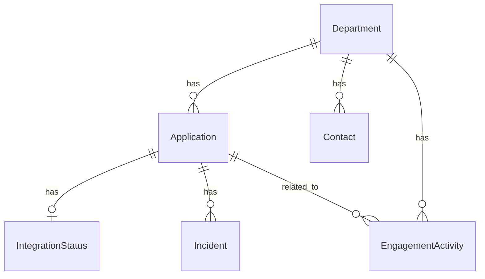

# CanadaLogin CRM

An internal CRM system for managing government department relationships with a sign-in (authentication) service provider. Built to replace Excel-based tracking with a structured, AI-ready system.


## Features

- **Department Management**: Track government customers with tier levels (critical/standard) and status
- **Application Tracking**: Manage applications integrating with the sign-in service (OIDC, SAML, legacy)
- **Integration Status**: Monitor integration progress through stages (intake → design → implementation → testing → production)
- **Contact Directory**: Store contacts by department with role categorization
- **Engagement Activities**: Log meetings, emails, workshops, and incidents with table view
- **Incident Management**: Track and resolve issues with severity levels
- **Filter Bars**: Every data tab includes a filter bar for quick drill-down:
  - Departments — Tier, Status, Owner Team, Search
  - Applications — Department, Environment, Auth Type, Status, Search
  - Integrations — Department, Stage, Status, Risk Level
  - Contacts — Department, Role, Active, Search
  - Activities — Department, Type, Owner, Date Range
  - Incidents — Severity, Status, Application, Date Range
- **AI Assistant**: Natural language queries powered by Google Gemini

## Tech Stack

- **Backend**: Python 3.13, Flask, SQLAlchemy
- **Database**: SQLite
- **Frontend**: HTML/CSS/JavaScript (Government of Canada style)
- **Charts**: Chart.js
- **AI**: Google Gemini API

## Quick Start

### 1. Clone the repository

```bash
git clone https://github.com/yourusername/gov-crm.git
cd gov-crm
```

### 2. Set up virtual environment

```bash
python3.13 -m venv venv
source venv/bin/activate  # On Windows: venv\Scripts\activate
```

### 3. Install dependencies

```bash
pip install -r requirements.txt
```

### 4. Configure environment (optional - for AI features)

```bash
cp .env.example .env
# Edit .env and add your Gemini API key
```

### 5. Run the application

```bash
python app.py
```

Open http://localhost:5000 in your browser.

## Configuration

Create a `.env` file with the following variables:

```env
GEMINI_API_KEY=your_gemini_api_key_here
SECRET_KEY=your_secret_key_here
```

## Project Structure

```
gov-crm/
├── app.py              # Flask application with REST APIs
├── models.py           # SQLAlchemy database models
├── database.py         # Database initialization and seed data
├── config.py           # Application configuration
├── requirements.txt    # Python dependencies
├── crm.db              # SQLite database (auto-generated)
├── templates/
│   └── index.html      # Main HTML template
└── static/
    ├── style.css       # Government of Canada styling
    └── app.js          # Frontend JavaScript
```

## API Endpoints

| Endpoint | Methods | Description |
|----------|---------|-------------|
| `/api/dashboard` | GET | Dashboard statistics |
| `/api/departments` | GET, POST | Departments CRUD |
| `/api/departments/<id>` | GET, PUT, DELETE | Single department |
| `/api/applications` | GET, POST | Applications CRUD |
| `/api/applications/<id>` | GET, PUT, DELETE | Single application |
| `/api/integrations` | GET | Integration statuses |
| `/api/integrations/<id>` | PUT | Update integration |
| `/api/contacts` | GET, POST | Contacts CRUD |
| `/api/contacts/<id>` | PUT, DELETE | Single contact |
| `/api/activities` | GET, POST | Engagement activities |
| `/api/activities/<id>` | DELETE | Delete activity |
| `/api/incidents` | GET, POST | Incidents CRUD |
| `/api/incidents/<id>` | PUT | Update incident |
| `/api/chat` | POST | AI chat (requires Gemini API key) |

## AI Assistant

The AI assistant can answer questions about your data using natural language. It supports:

### Text Queries
- "Which departments are critical?"
- "Show me delayed integrations"
- "Who is the technical contact for CRA?"
- "What applications are currently in testing?"

### Chart Generation
Ask for visualizations and get interactive charts:
- "Show me a chart of applications by status"
- "Create a pie chart of departments by tier"
- "Visualize integration risk levels as a bar chart"

Supported chart types: bar, pie, doughnut, line

### Conversation History
The AI remembers your chat context for follow-up questions:
- You: "Which departments are critical?"
- AI: *lists critical departments*
- You: "How many applications do they have?" *(AI understands context)*

### Clear/New Chat
Use the buttons in the chat header to reset the conversation.

## Data Model



## License

MIT License

## Contributing

1. Fork the repository
2. Create a feature branch (`git checkout -b feature/amazing-feature`)
3. Commit your changes (`git commit -m 'Add amazing feature'`)
4. Push to the branch (`git push origin feature/amazing-feature`)
5. Open a Pull Request
